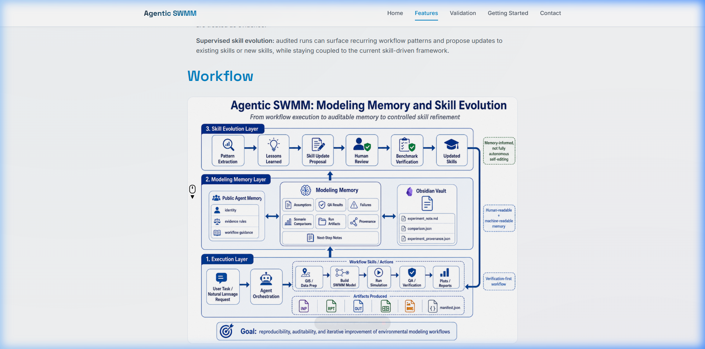
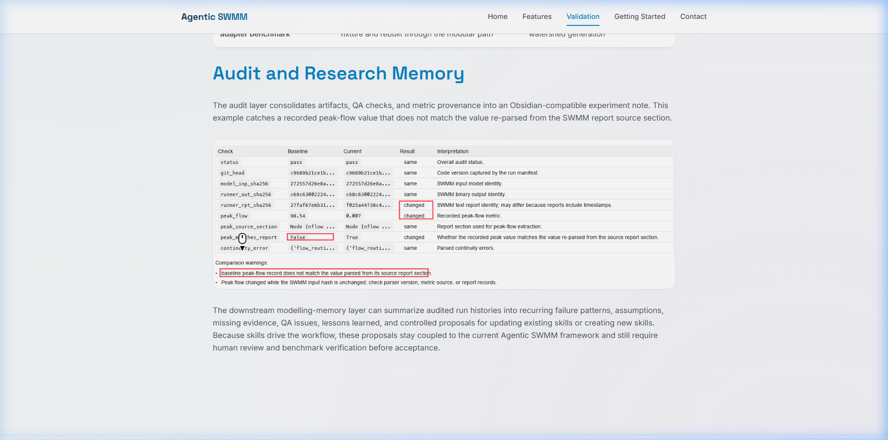

# Agentic SWMM Website & Project Website Builder

Official website source for [Agentic SWMM Workflow](https://github.com/Zhonghao1995/agentic-swmm-workflow), a verification-first framework for reproducible stormwater modeling with EPA SWMM.

This repository also provides a reusable academic and open-source project website template. It includes a responsive six-page site, SEO/social metadata, and an AI website-builder skill that can help researchers and developers generate similar project websites quickly.

- Live website: https://aiswmm.com
- Agentic SWMM Workflow: https://github.com/Zhonghao1995/agentic-swmm-workflow
- Preprint: https://doi.org/10.31223/X5F47G




## What this repository provides

- The public website source for Agentic SWMM Workflow.
- A ready-to-edit multi-page website for software, papers, models, datasets, and research tools.
- Six core pages: Home, Vision, Features, Validation, Download, and Contact.
- Responsive HTML and CSS that works on desktop and mobile.
- SEO and social sharing metadata for GitHub, LinkedIn, Twitter/X, and other platforms.
- A reusable `project-website-builder` AI Skill for generating similar project websites.
- MIT License for academic, open-source, and commercial reuse.

## Why it exists

Many research projects and open-source tools have strong code but weak public-facing documentation. A good project website should help visitors understand what the project does, why it matters, how to try it, what evidence supports it, and how to cite or contribute to it.

This repository solves that problem in two ways:

- It gives Agentic SWMM Workflow a clear public website for presenting reproducible stormwater modeling work.
- It gives other researchers a lightweight website template they can fork, customize, and deploy without setting up a complex frontend framework.

## About Agentic SWMM Workflow

Agentic SWMM Workflow is a verification-first framework for reproducible stormwater modeling with EPA SWMM. It focuses on deterministic model execution, provenance tracking, QA checks, modeling memory, calibration support, documentation, and auditable outputs while keeping human modelers in control.

The workflow is designed for projects where model runs need to be repeatable, inspectable, and easier to explain. It can be used with Docker, local scripts, and agentic coding environments such as Codex, OpenClaw, or Hermes.

Useful links:

- Repository: https://github.com/Zhonghao1995/agentic-swmm-workflow
- Latest release: https://github.com/Zhonghao1995/agentic-swmm-workflow/releases/latest
- Preprint: https://doi.org/10.31223/X5F47G

## Who this template is for

This website template is useful for:

- Researchers who need a clean project website.
- PhD students presenting a paper, model, dataset, or software tool.
- Open-source scientific software projects.
- Hydrology, stormwater, environmental modeling, GIS, and engineering workflows.
- Teams that want a static website they can deploy with GitHub Pages, Netlify, Vercel, or any simple web host.

## Quick start

You can use this repository in two ways.

### Option 1: Use it as a static website template

1. Fork or download this repository.
2. Edit the HTML files:
   - `index.html`
   - `vision.html`
   - `features.html`
   - `validation.html`
   - `download.html`
   - `contact.html`
3. Update `styles.css` if you want to adjust the visual design.
4. Replace screenshots, favicon, links, authors, and citation details.
5. Deploy with GitHub Pages, Netlify, Vercel, or your own server.

No build step is required. You can preview the site locally with:

```bash
python -m http.server 8000
```

Then open:

```text
http://127.0.0.1:8000/index.html
```

### Option 2: Use the included AI website-builder skill

The `project-website-builder` folder contains a reusable AI Skill. You can give this folder to an AI coding assistant such as Codex, Claude, Gemini, or a similar agentic coding tool.

Basic workflow:

1. Provide the `project-website-builder` folder to your AI assistant.
2. Give the assistant your project name, summary, links, authors, paper, repository, and deployment target.
3. Ask it to generate a customized six-page project website from the template.
4. Review the generated pages and deploy them.

The skill is designed to help produce a complete first draft quickly, while leaving all scientific claims, citations, and project-specific content under human review.

## Website structure

- **Home**: project summary, key message, and call-to-action links.
- **Vision**: project motivation, pain points, and high-level direction.
- **Features**: workflow highlights, capabilities, and differentiators.
- **Validation**: benchmarks, evidence boundaries, audit records, or case studies.
- **Download**: installation guide, Docker commands, releases, and repository links.
- **Contact**: authors, collaboration information, and citation details.

## Reuse checklist

When adapting this template for your own project, update:

- Project name, short name, and tagline.
- GitHub repository, paper, release, and live site links.
- Open Graph metadata in `index.html`.
- Preview images in `assets/`.
- Author and citation information.
- Validation claims and evidence boundaries.
- `CNAME` if using a custom domain with GitHub Pages.


## License

This project is released under the MIT License. You are free to use, modify, and distribute it for academic, open-source, and commercial projects.
